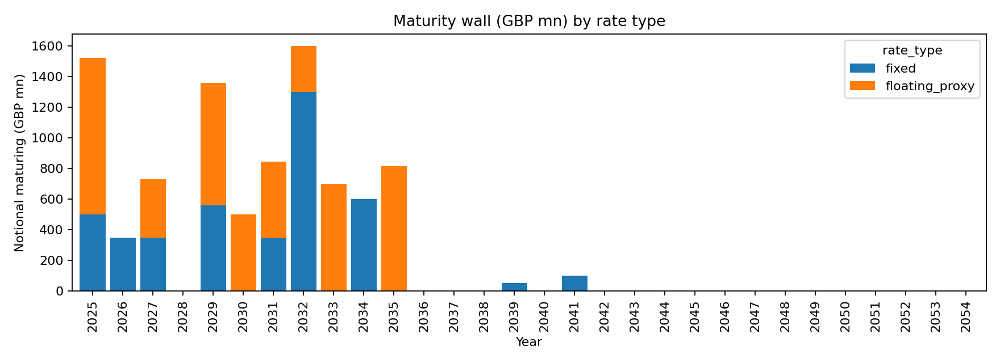
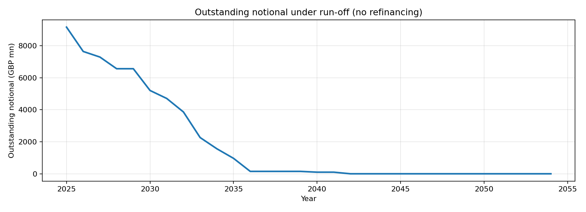
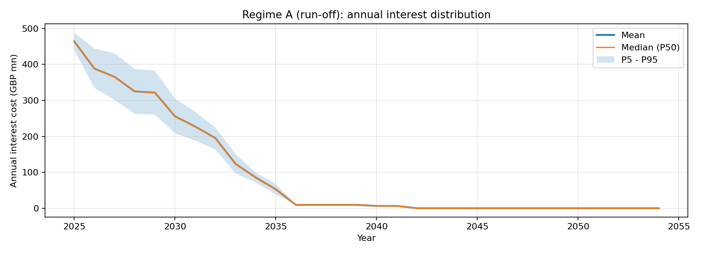
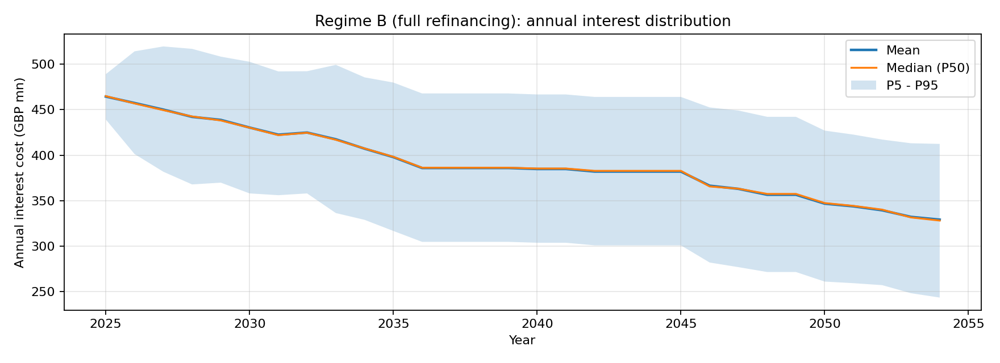
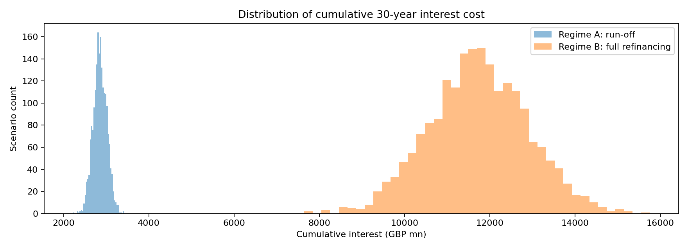

# Refinancing Strategy Simulation (Scottish Power debt stack)

## Slide 1 - Debt stack at a glance
- Total notional modelled: **9,170 mn GBP**
- Mix by rate type:
  - Fixed: **45.3%**
  - Floating proxy (Base/SONIA + spread): **54.7%**
- Weighted-average maturity (WAM): **6.18 years**

## Slide 2 - Interest outcomes under two regimes
- Regime A (run-off): debt naturally amortizes, reducing tail exposure.
- Regime B (full refinancing): notional is repeatedly rolled into 20-year fixed bonds at scenario rates.
- Annual distributions are shown with mean/median and P5-P95 bands.

## Slide 3 - Cumulative cost impact and risk years
- 30-year cumulative interest (mn GBP):
  - Regime A mean: **2,855**, P5/P50/P95: **2,589 / 2,852 / 3,122**
  - Regime B mean: **11,728**, P5/P50/P95: **9,818 / 11,725 / 13,604**
- The full-refinancing regime typically has larger cumulative cost and wider distribution because the portfolio keeps reloading duration.
- Most sensitive years (largest P95-P5 spread):
- 2047: P95-P5 spread = 172.1 mn GBP
- 2048: P95-P5 spread = 170.6 mn GBP
- 2049: P95-P5 spread = 170.6 mn GBP

## Slide 4 - Why these risk years matter
- Risk is concentrated where both (a) outstanding notional is still high and (b) floating-rate exposure or newly refinanced coupons are active.
- Under full refinancing, scenario dispersion propagates for 20-year windows after each issuance, so uncertainty compounds.
- Under run-off, uncertainty decays as principal declines.

## Slide 5 - SONIA-linked refinancing variant (qualitative)
- If new debt were SONIA-linked instead of fixed:
  - Near-term cashflow volatility increases (coupon resets every period).
  - Duration risk drops because refinancing locks less long-term rate exposure.
  - P5-P95 spread shifts from long-tail level risk to short-horizon path risk.
- Model change: replace fixed coupon lock-in at issuance with yearly/periodic coupon = SONIA path + contractual spread.
